# MovieCatalogue

## About The Project
This is an android application that made for the final project submission for **"Belajar Fundamental Aplikasi Android" (Android Fundamentals)** course on Dicoding (2019). This application shows a list of **Movies & TV Shows** that currently on Cinema, along with their information for each of the Movie or TV Show. This app also has various other features like adding Movies or TV Shows into Favorite Lists, Search a Movie or TV Shows from query, and Change Language.

## Screenshots
Dashboard (Movies) | Detail Page (Movies) | Dashboard (TV Shows) | Detail Page (TV Shows)
:-------------------------:|:-------------------------:|:-------------------------:|:-------------------------:
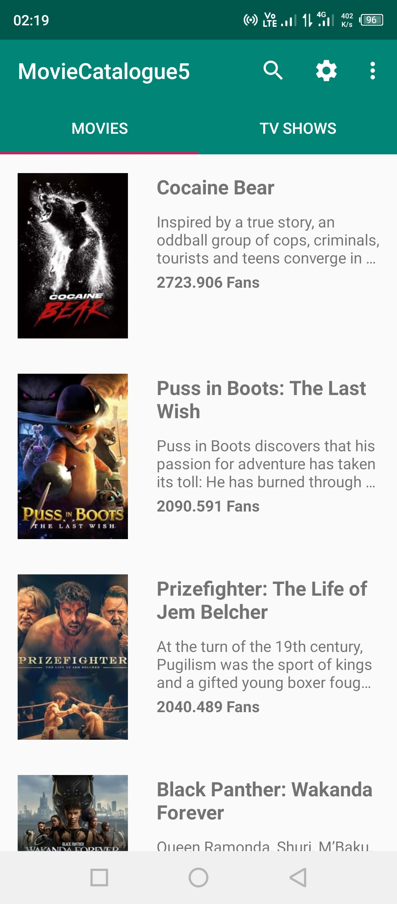  |  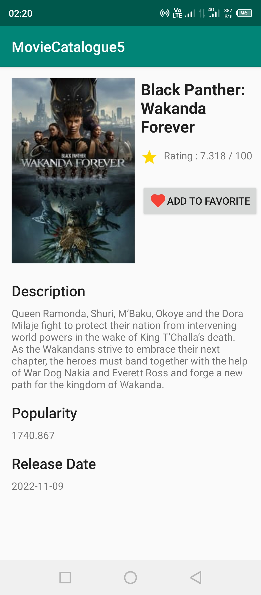  |  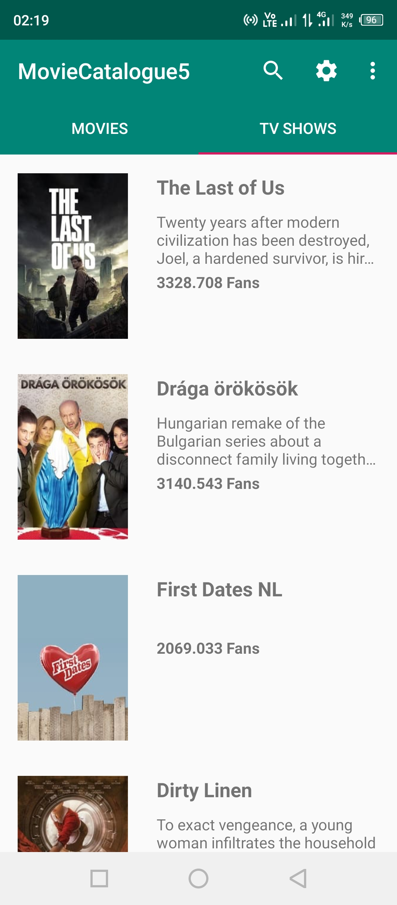  |  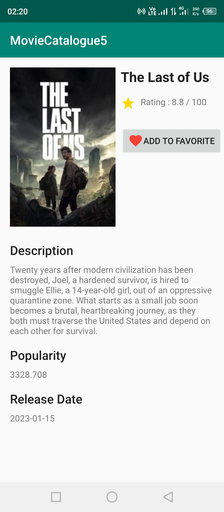
Favorite Movie | Detail Favorite (Movies) | Favorite TV Shows | Detail Favorite (TV Shows)
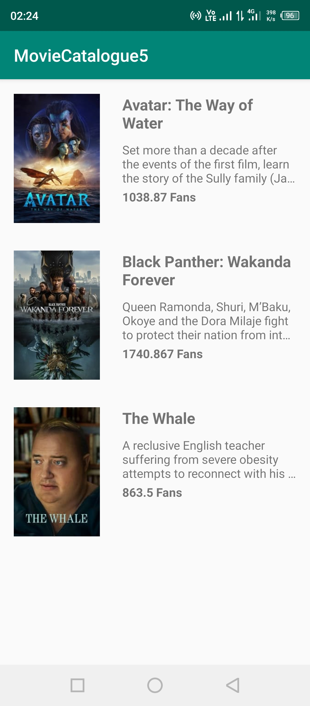  |  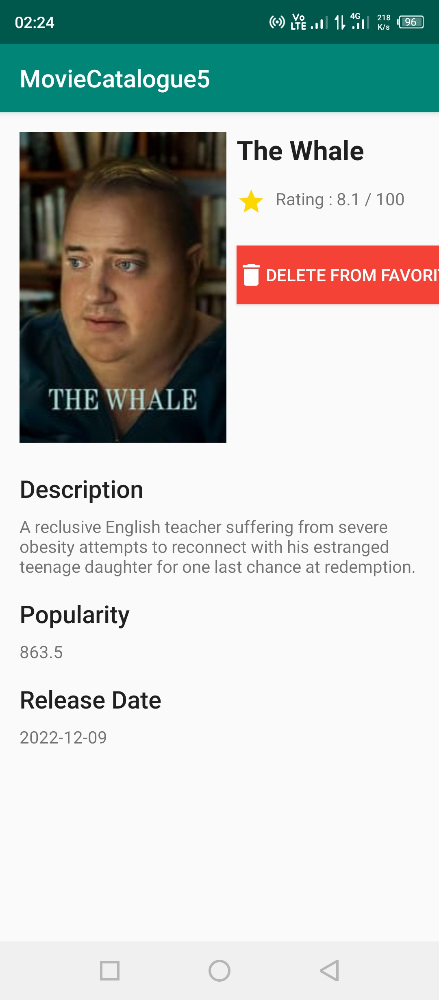  |  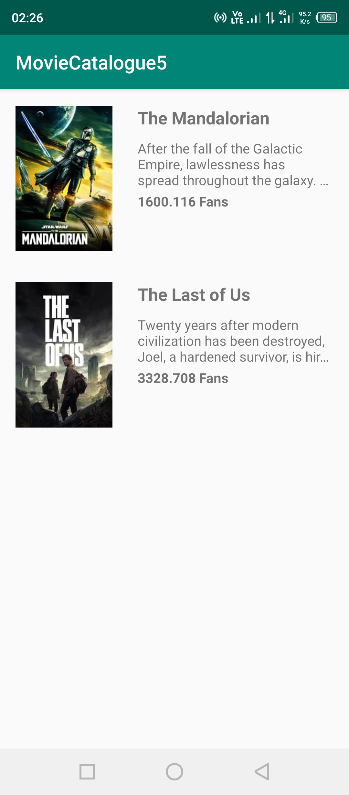  |  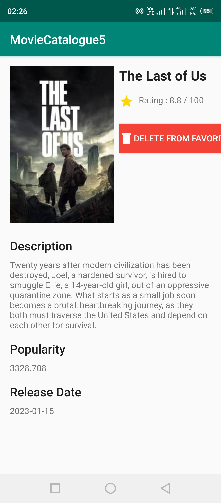
Search Result (Query: "Black Panther") | Reminder Setting | Widget in Homescreen
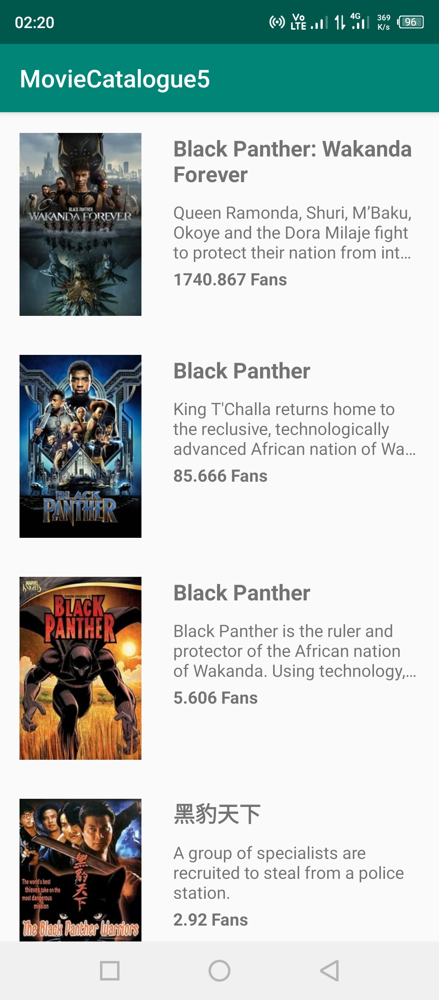  |  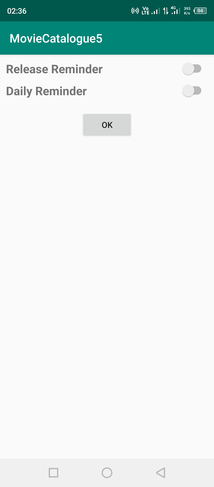  |  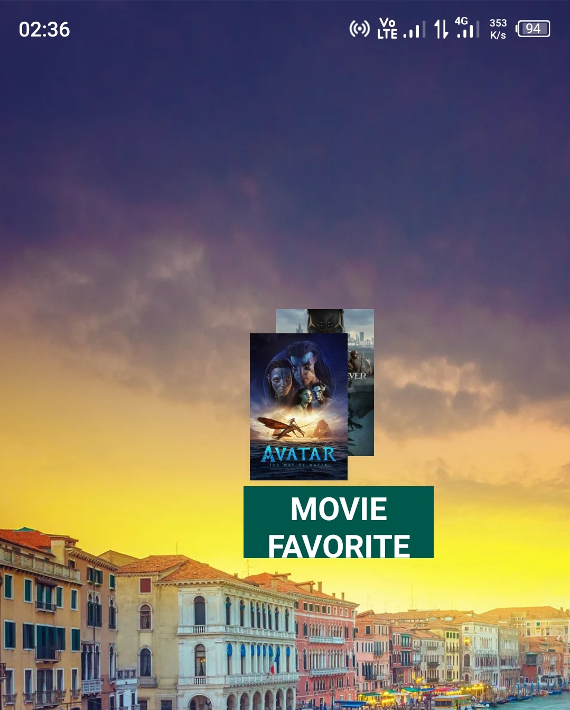

## Features
* Popular Movies & TV Shows that currently on Cinema
* Favorite Movies & Favorite TV Shows Lists (Add & Delete Favourite Movies & TV Shows)
* Change the Language (Localization)
* Search a Movie or TV Shows by Keywords
* Add Widget on Phone Homescreen
* Reminder/ Daily Movie Notification (Note: Reminder is the only feature that i haven't completed to be able to get the certificate)

## Technology Used
* Android Studio
* Java Programming Language
* Object-oriented Programming
* API from [The Movie Database (TMDB)](http://api.themoviedb.org/)
* Asynchronous HTTP using AsyncHttpClient
* Glide (Image library)
* SQLite
* Fragment
* RecyclerView
* Intent
* AppWidgetProvider
* AlarmManager

## Installation

You can install this app on your android phone by downloading the APK file in [app/release/app-release.apk](app/release/app-release.apk). Copy and open it on your android phone, and follow the installation process.
